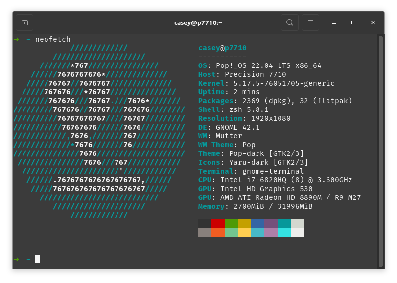
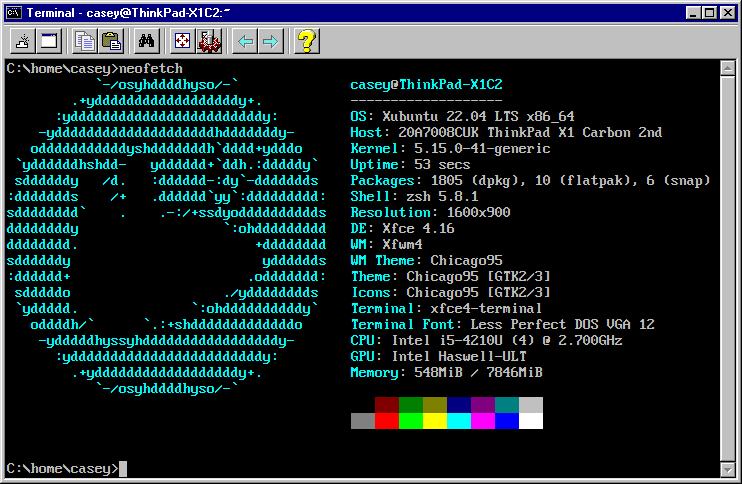

# 💻 Battlestations

Listed in order of primary purpose.

## Dell Latitude 7710

Main workhorse.

## ThinkPad X1 Carbon - Generation 2

Used for portable programming.

## Toshiba Satelite Pro (Hackintosh)

When macOS testing is needed.

## Asus Transformerbook T100TAF

For situations of more portability.

## Dell Wyse

Tampering with low yield operating systems.

## Raspberry Pi 3

Home automation main host and Docker server.

